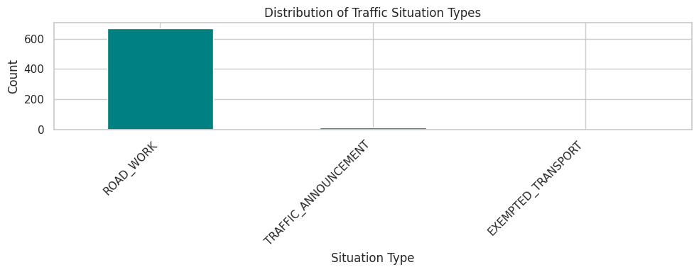
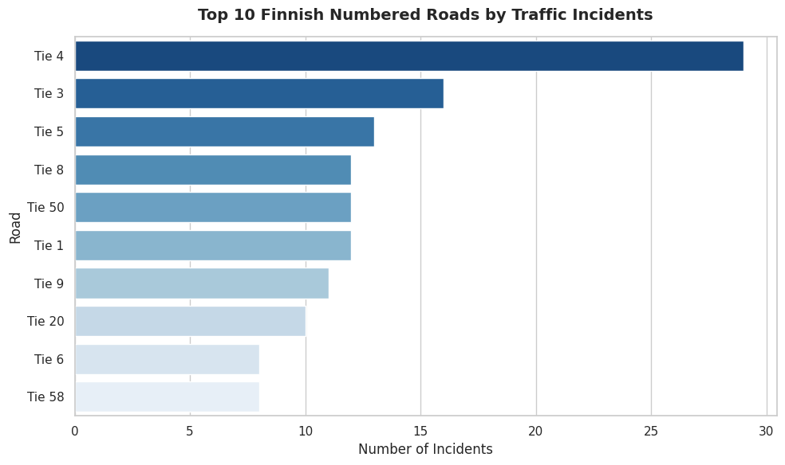

# 🚦 Finnish Traffic & Infrastructure Analysis

Ever wondered what’s *really* happening on Finland's roads beyond what a quick look at a map app tells you? 

This is a small data analysis project where I built an automated pipeline using Python, SQL, and Finland's official **Fintraffic API** to pull live traffic data, clean it up, and uncover patterns in road works and maintenance schedules across Finland.

> 📅 **Analysis Date:** 15.09.2026 *(Based on live API extraction)*

---

## 💡 Why did I build this?
If you're driving, a map app just helps you avoid a traffic jam. But if you look at the bigger picture — like how delivery companies plan their routes or how cities manage infrastructure — you need **real data, not just a map**.

This project helps answer a few simple questions:
* **Where are the road works?** (Turns out, about 97% of all active traffic alerts right now are planned road maintenance and upgrades).
* **When do they actually work?** (Digging into the schedules reveals that road crews often work night shifts — for example, from 19:00 to 03:00 — to avoid daytime traffic chaos).
* **What's next?** (I plan to collect data over the coming months to build my own history and see how autumn road works gradually transition into winter warnings for snow, ice, and snowplowing across Finland).

---

## 📊 Key Findings & Visual Insights

### 1. Structure of Traffic Events
Statistical distribution analysis shows that the vast majority of active records (~97%) are tied to planned highway maintenance (`ROAD_WORK`), reflecting heavy seasonal road upkeep across the country.



### 2. Top Corridors with Most Incidents
Analyzing the numbered highways reveals that major national arteries—specifically **Tie 4**, **Tie 3**, and **Tie 5**—account for the highest concentration of active road works and maintenance alerts.



---

## 🛠️ Tech Stack
* **Python** (Pandas, NumPy, JSON) for data extraction and processing
* **Databricks & Delta Lake** for cloud storage and data pipelining
* **Matplotlib & Seaborn** for data visualization
* **Fintraffic Open API** as the primary data source

---

## 📂 Project Structure
```text
├── 01_traffic_data_ingestion.py    # Pipeline: Grabs live data from the API & saves it to Delta Lake
├── 02_traffic_incidents_eda.py     # EDA: Cleans the data, runs statistics, and builds visual charts
├── top_roads.png                   # Visualization: Top 10 numbered roads by incidents
└── traffic_distribution.png        # Visualization: Distribution of traffic situation types


---

## 🚀 How to Run It

1. Clone the repo:
   ```bash
   git clone [https://github.com/kocherzhat3-lgtm/fintraffic-traffic-pipeline.git](https://github.com/kocherzhat3-lgtm/fintraffic-traffic-pipeline.git)

---

## 👩‍💻 Author

**Oksana Kocherzhat**  
Data Analyst (OAMK)  
📍 Finland  
🔗 LinkedIn: https://www.linkedin.com/in/oksana-kocherzhat-834518231
